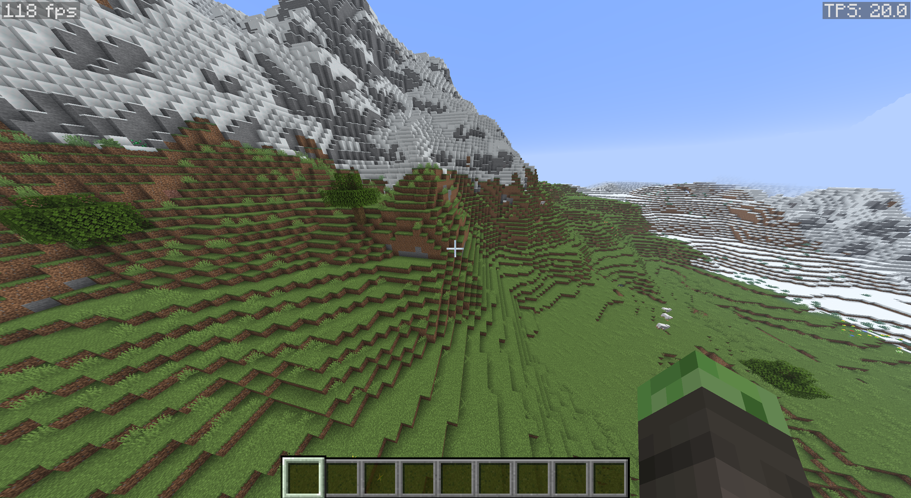
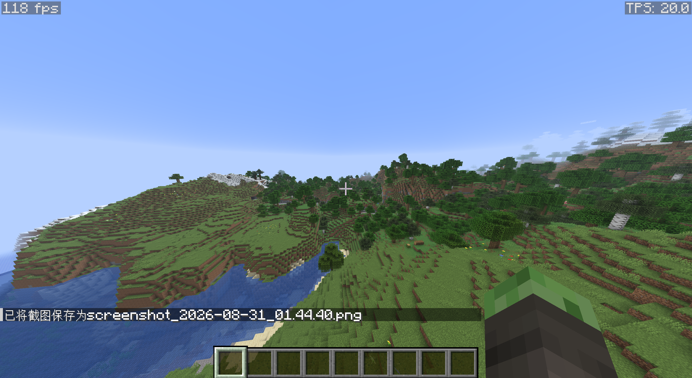
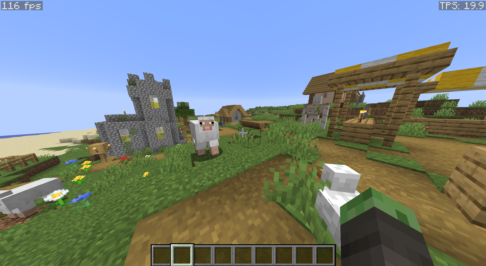
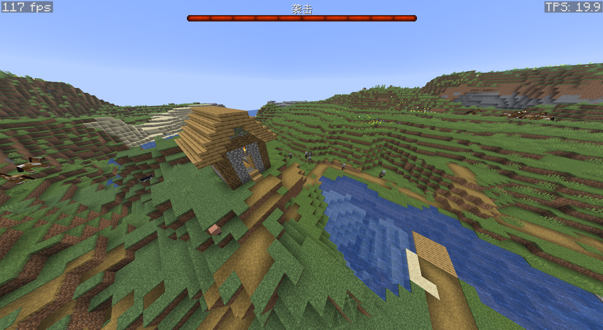
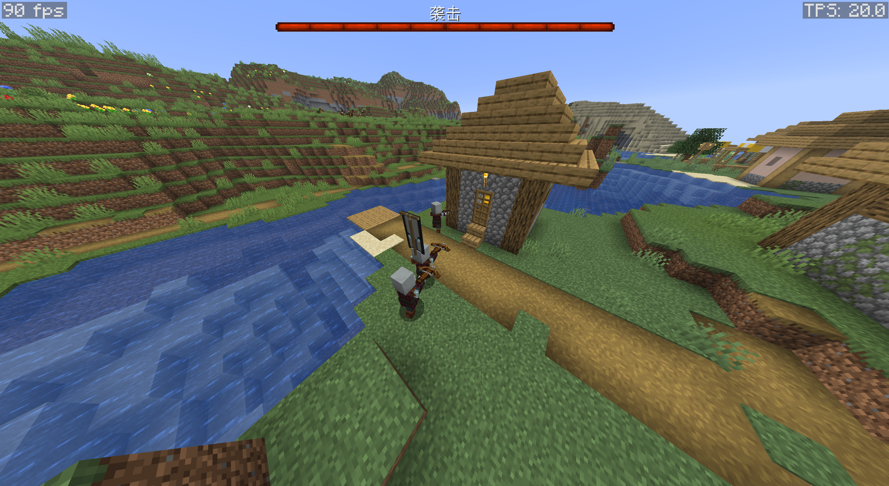

+++
date = 2026-08-31T09:03:42+08:00
draft = false
title = '“任何可以用 JavaScript 编写的应用，最终都必将用 JavaScript 编写。”'
description = '在浏览器中的 Minecraft 26.2'
image = 'assets/cf45928f8c6db55aab9e1675e3af7ec6a5e5157c.png'
categories = ['编程']
tags = ['游戏']
+++

# *"Anything that can be written in JavaScript will eventually be written in JavaScript."*

这是2026年的Web游戏。直接将`Minecraft 26.2`搬进了浏览器……（[网页链接](https://mcjs.link/)）



当我一开始看到这个网页，我整个人都震惊了。因为我从来没有想过有人能在浏览器里把MC还原个八九成的样子。以前我看到的网页游戏都是像[POKI](https://poki.com/zh)那样非常简单、无脑。当然，它的质量也不会说特别高，可能就是简简单单的几个像素就搞定了，甚至就在我这样一个分辨率不算高的屏幕上我都能看到瑕疵（比如非常简单的抗锯齿，效果俗称“狗牙”）。

但是当我看到有人能把这样一个**史上销量第一**的游戏给它照搬进浏览器里，而且甚至能保留加载资源包等等特性，那真是了不起。

我以前可能是低估了网页的实力。其实我从来没有深挖过WebGL这一块，因为它对我来说并没有什么实质性的用处。日常的Web开发无非就是一个标签套另一个标签。然后呢，写点样式表，再加亿点JS代码就可以了。我根本没有想过在浏览器中还原那些经典的游戏，像有些人去还原俄罗斯方块、贪吃蛇。最经典的还是Edge Surf和谷歌的Dino Run。

可能也是我注重实用。所以我对这些技术都不是特别地看重，因为没有人说我去看个电影，我要用WebGL；没有人说我去网上购物，我需要动用canvas。

以前我都在学习怎么用CSS做出一个漂亮的动画，看着那些大神用CSS还原中国的图。但是现在我觉得我真的要重新审视这一块领域了。

我想起来之前**Jeff Atwood**说过的一句话。

> Anything that can be written in JavaScript will eventually be written in JavaScript.
> 
> 任何可以用JavaScript编写的应用，最终都将用JavaScript编写。

果真是这样

我想不到我烧录自己的作品到ESP32芯片的时候我竟然可以使用浏览器这个软件。我想不到有人会绞尽脑汁还原Liqurd Glass。

其实刚刚我说的这些话都很混乱，首先我使用语音输入，其次是我是真真实实被这个项目吓到了。我现在哑口无言。所以还是用一些截图来终结这个文章吧。在看的时候想一想，你真的能看得出这是浏览器中的MC吗？

最后再说一句，我不知道开发者把[Minecraft Wiki](https://zh.minecraft.wiki/)背得有多滚瓜烂熟。这里也给出[GitHub链接](https://github.com/mcjsteam/mcjs)，如果有问题请到这里提交。哦耶！又水了一篇文章。
