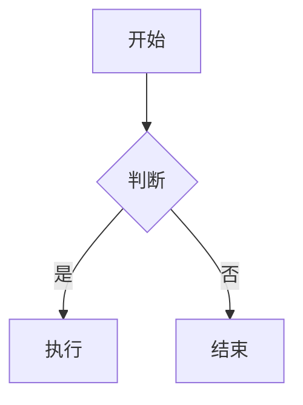

+++
date = '2026-07-06T10:28:56+08:00'
draft = false
title = 'Markdown指南'
+++

实在没有东西写了。

“杨花榆荚无才思，惟解漫天作雪飞“

让AI写了点东西，于是就有了：

这是一份由**AI生成**的全面且实用的 **Markdown 语法指南**。无论你是写作新手还是希望查漏补缺的进阶用户，这份指南都能满足你的需求。

---

# 📘 Markdown 语法完全指南

## 1. 基础语法

### 标题

使用 `#` 号表示标题，1-6 个 `#` 分别对应一级到六级标题。

```markdown
# 一级标题
## 二级标题
### 三级标题
#### 四级标题
```

> 💡 **提示**：`#` 与标题文字之间必须有一个空格。

### 文本样式

| 样式        | 语法                  | 效果示例      |
| --------- | ------------------- | --------- |
| **粗体**    | `**粗体**` 或 `__粗体__` | **粗体**    |
| *斜体*      | `*斜体*` 或 `_斜体_`     | *斜体*      |
| ***粗斜体*** | `***粗斜体***`         | ***粗斜体*** |
| ~~删除线~~   | `~~删除线~~`           | ~~删除线~~   |
| `行内代码`    | `` `code` ``        | `code`    |
| 高亮(部分支持)  | `==高亮==`            | ==高亮==    |

### 列表

**无序列表**：使用 `-`、`*` 或 `+` 开头（推荐使用 `-`）

```markdown
- 项目一
- 项目二
  - 子项目（缩进2-4空格）
```

**有序列表**：使用数字加点 `1.` 开头

```markdown
1. 第一步
2. 第二步
3. 第三步
```

**任务列表**（GFM 扩展语法）：

```markdown
- [x] 已完成任务
- [ ] 未完成任务
```

### 引用

使用 `>` 表示引用，可嵌套使用。

```markdown
> 这是一级引用
>> 这是嵌套引用
```

### 分隔线

使用三个或以上 `-`、`*` 或 `_`（单独一行）。

```markdown
---
```

---

## 2. 链接与图片

### 链接

```markdown
[显示文本](URL "可选的鼠标悬停提示")
```

示例：[GitHub](https://github.com/ "全球最大的代码托管平台")

### 图片

```markdown

```

> 💡 图片语法仅比链接多一个感叹号 `!`。

### 图片链接（组合使用）

```markdown
[](链接URL)
```

---

## 3. 代码展示

### 行内代码

用反引号包裹：`` `console.log('hello')` ``

### 代码块

使用三个反引号 + 语言名称（可选），支持语法高亮：

```markdown
```python
def hello():
    print("Hello, Markdown!")
```
```

常用语言标识：`python`, `javascript`, `java`, `sql`, `bash`, `json`, `html`, `css`, `go`, `rust` 等。

---

## 4. 表格

```markdown
| 左对齐 | 居中对齐 | 右对齐 |
| :----- | :------: | -----: |
| 内容   | 内容     |   内容 |
| 内容   | 内容     |   内容 |
```

> 💡 第二行的 `:` 位置决定对齐方式；至少需要表头和分隔行两行才能渲染为表格。

---

## 5. 转义字符

当需要显示 Markdown 特殊符号本身时，使用 `\` 转义：

```markdown
\* 这不会变成斜体 \*
\# 这不会变成标题
$$ 这不会变成链接 $$
```

可转义字符：``\ ` * _ { } [ ] ( ) # + - . ! |``

---

## 6. 高级 / 扩展语法（GFM & 常见扩展）

以下语法并非所有编辑器都支持，但在 GitHub、Typora、Obsidian 等平台中广泛可用。

### 脚注

```markdown
这里有一个脚注[^1]。

[^1]: 这是脚注的内容。
```

### 数学公式（LaTeX）

```markdown
行内公式：$E = mc^2$

块级公式：
$$
\sum_{i=1}^{n} x_i = x_1 + x_2 + \cdots + x_n
$$
```

### Mermaid 图表

```markdown

```

### HTML 混用

Markdown 中可直接嵌入 HTML：

```markdown
<div style="color:red">红色文字</div>
<br/>  <!-- 强制换行 -->
<details><summary>点击展开</summary>隐藏内容</details>
```

---

## 7. 最佳实践 ✅

| 建议       | 说明                                 |
| -------- | ---------------------------------- |
| 中英文之间加空格 | `使用 Markdown 写作` 而非 `使用Markdown写作` |
| 标点符号规范   | 中文语境用全角标点，英文/代码用半角                 |
| 保持源码可读   | 段落间空一行，列表前后空一行                     |
| 统一风格     | 选定一种列表符号（如 `-`）全文统一                |
| 善用预览     | 实时预览确保渲染正确                         |

---

## 🛠️ 推荐工具

- **Typora**：所见即所得，体验极佳（付费）
- **Obsidian**：知识管理 + Markdown，插件生态丰富（免费）
- **VS Code**：配合 Markdown All in One 插件（免费）
- **Notion / 飞书文档**：在线协作，原生支持 Markdown 快捷输入
- **MarkText**：开源免费的 Typora 替代品

---

完整教程见[菜鸟教程](https://www.runoob.com/markdown/md-tutorial.html)
