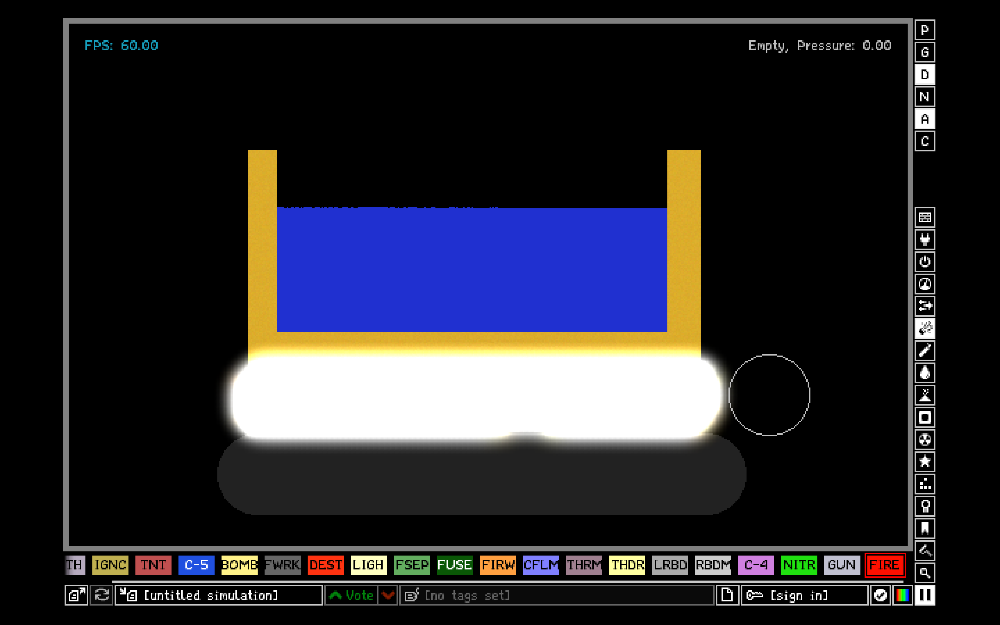
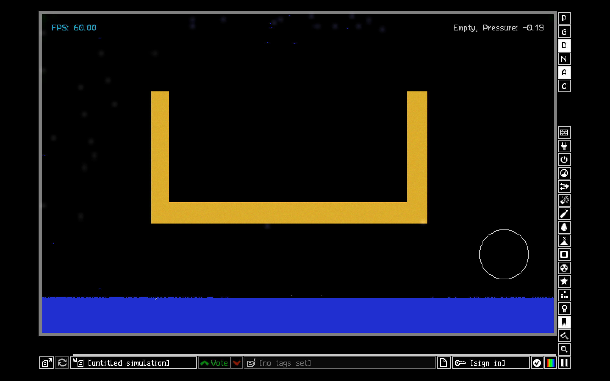

+++
date = 2026-07-06T10:28:56+08:00
draft = false
title = '做了一口金锅烧水'
description = 'The Powder Toy是个好东西'
categories = ['软件']
tags = ['整活','游戏']
+++

# 做了一口金锅烧水

我最近从[Flathub](https://flathub.org/zh-Hans)上发现了[The Powder Toy](https://powdertoy.co.uk/)，一个物理模拟软件（模拟结果可信度未知）。它给我的第一印象是“麻雀虽小，五脏俱全”

一开始还有点不会用，然后看了教程做出来了这个：

一口金锅烧水！后来全蒸发了。还好我的金锅没有事。但是我发现一个严峻的问题：我把边界开了。这意味着这些水变成水蒸气后无法离开屏幕这个微小的空间。它们只可以聚集在这里面。

过了一会

为什么水全部都到下面来了？为什么没有一点落到金锅里面？

> 其实我刚才注意到了，屏幕上方形成了两股漩涡状的气流。应该是它们“卷”着水蒸气下来的。可能是中间空气热，两边空气冷，导致水蒸气在屏幕两边直接变成了液态水，落了下来。

以上也是胡说乱想，但结果摆在这里了。到时候再做一遍，看看是为什么。

最后，这个软件是怎么做到那么小的？
