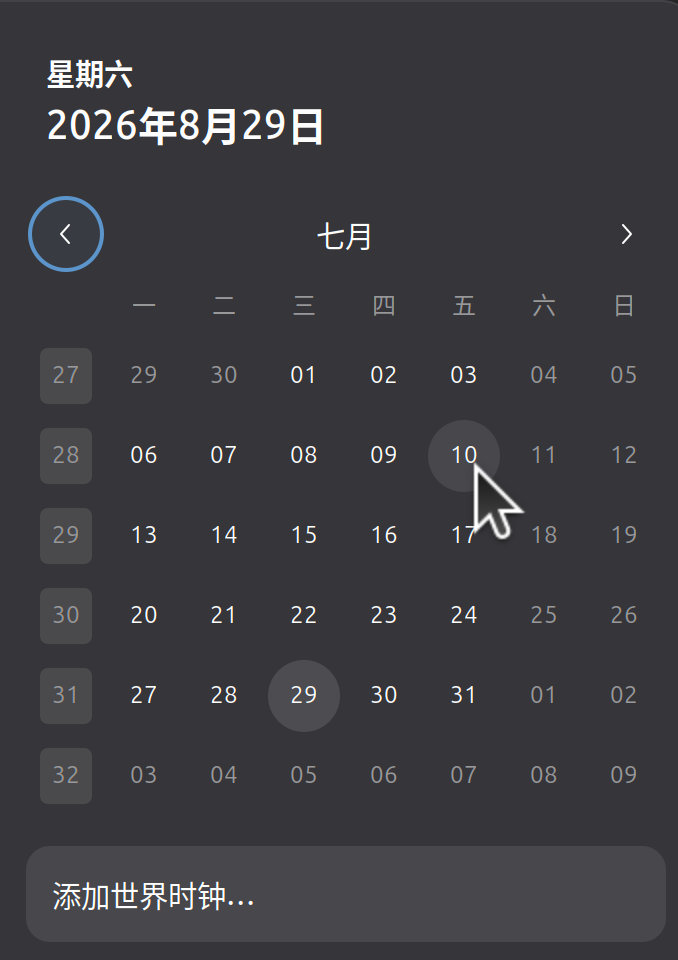

+++
date = 2026-08-29T21:00:25+08:00
draft = false
title = '暑假！'
keywords = ["假期"]
tags = ['暑假']
description = '"缅怀"逝去的暑假'
+++

暑假是一个好东西，但是过得是真的快

> 你希望时间过得快的时候，它就过得慢
> 
> 你希望时间过得慢的时候，它就过得快

当我在写**终于建好了**的时候，那还是……

在这里还是要惋惜一下，7月的11~15日，这几天简直算浪费时间……虚度年华……

具体发生了什么事情，我希望以后写一个《暑假大事记》来细说。
